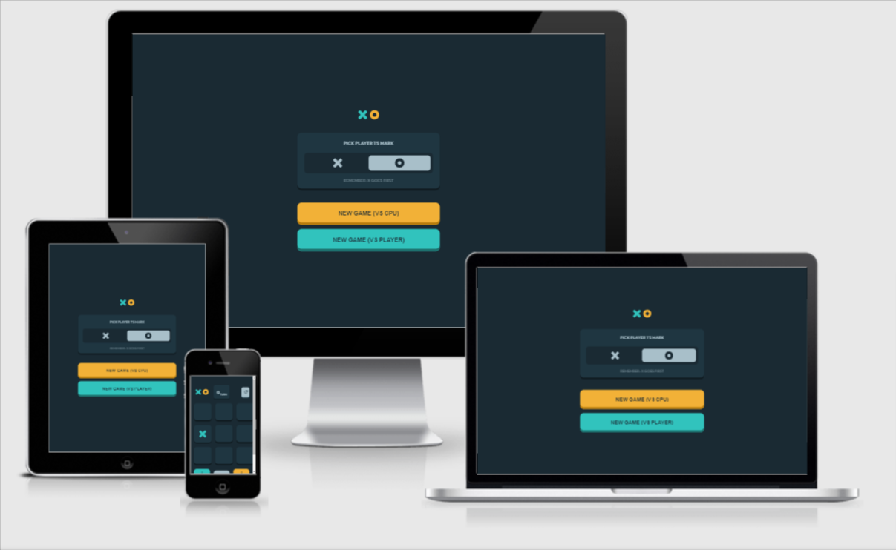
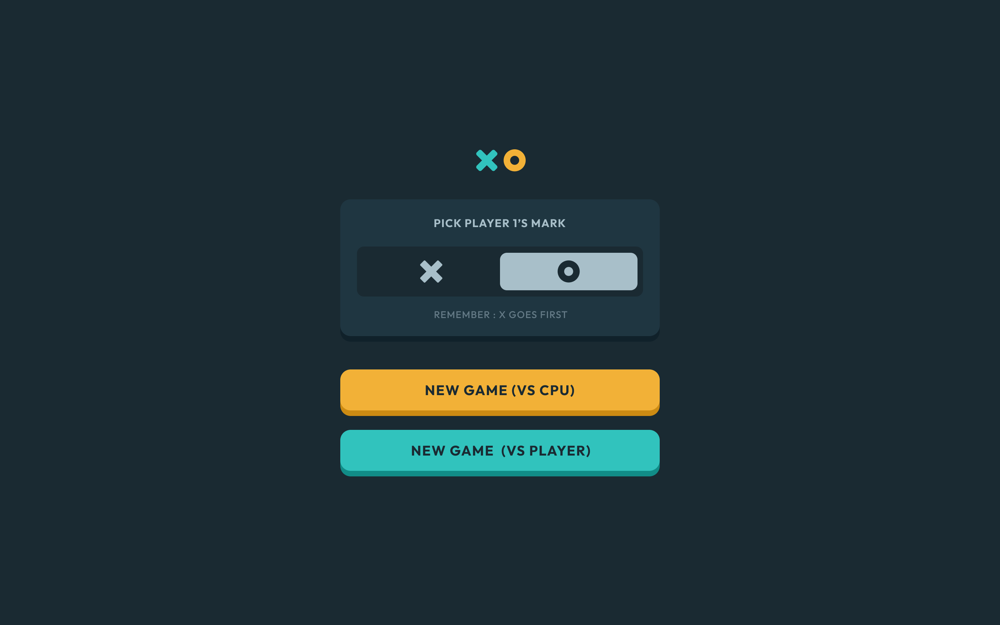
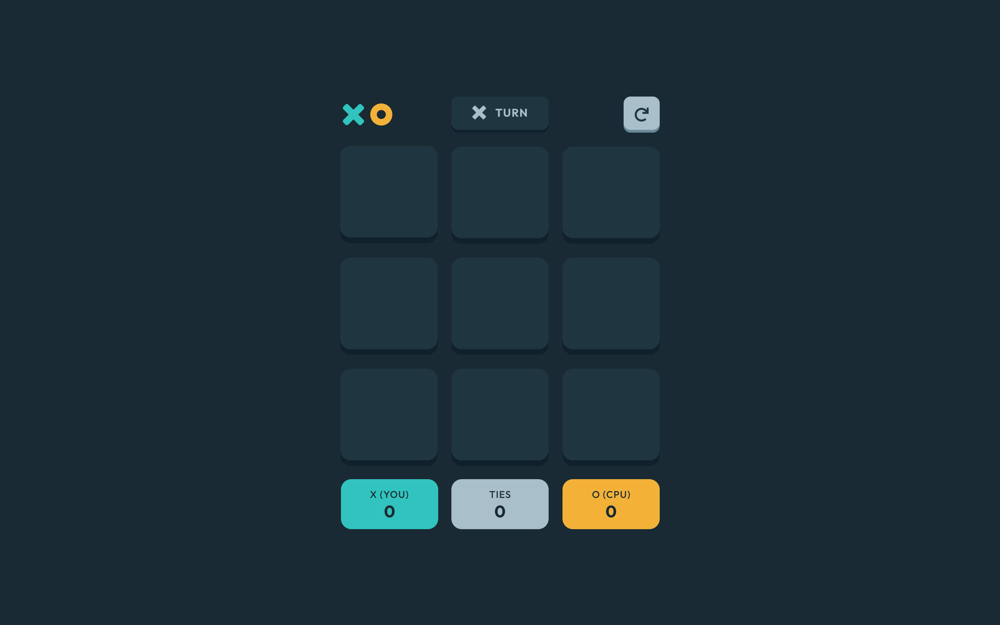
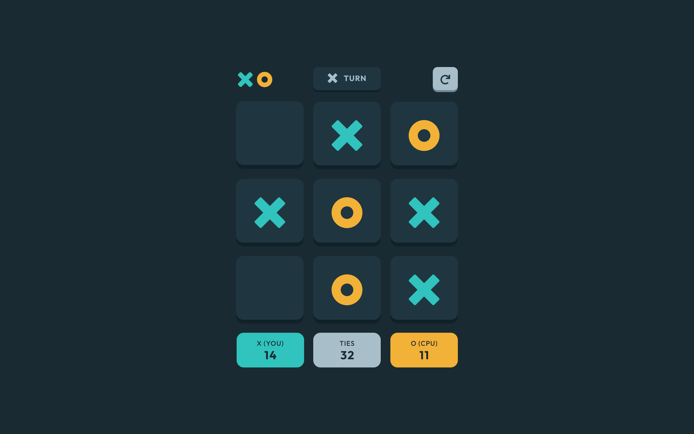
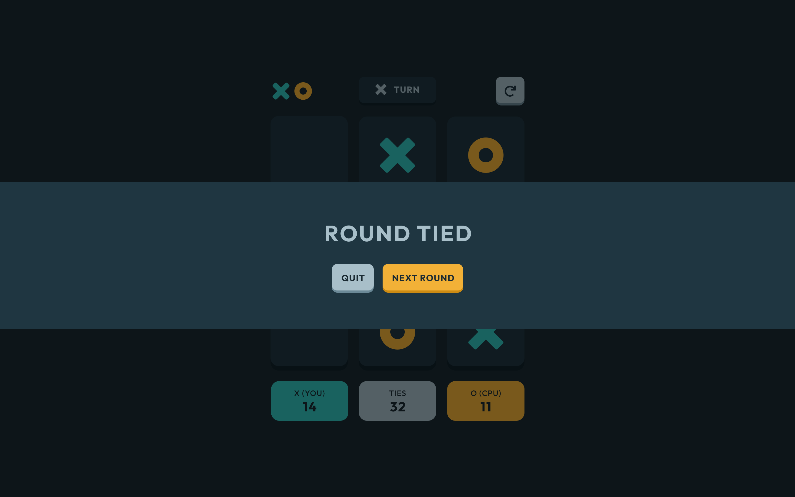
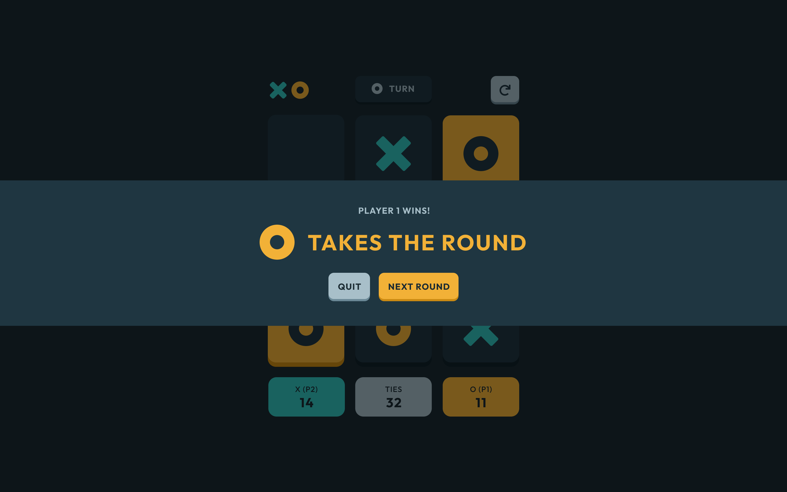
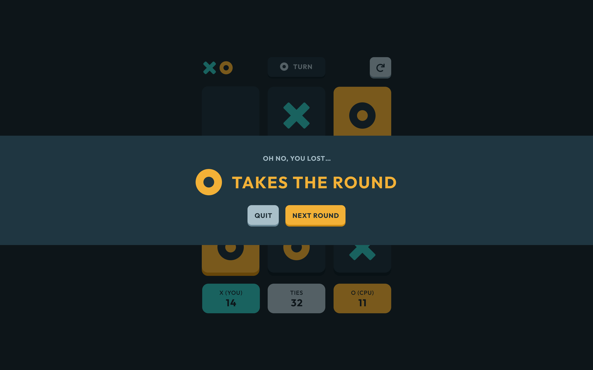
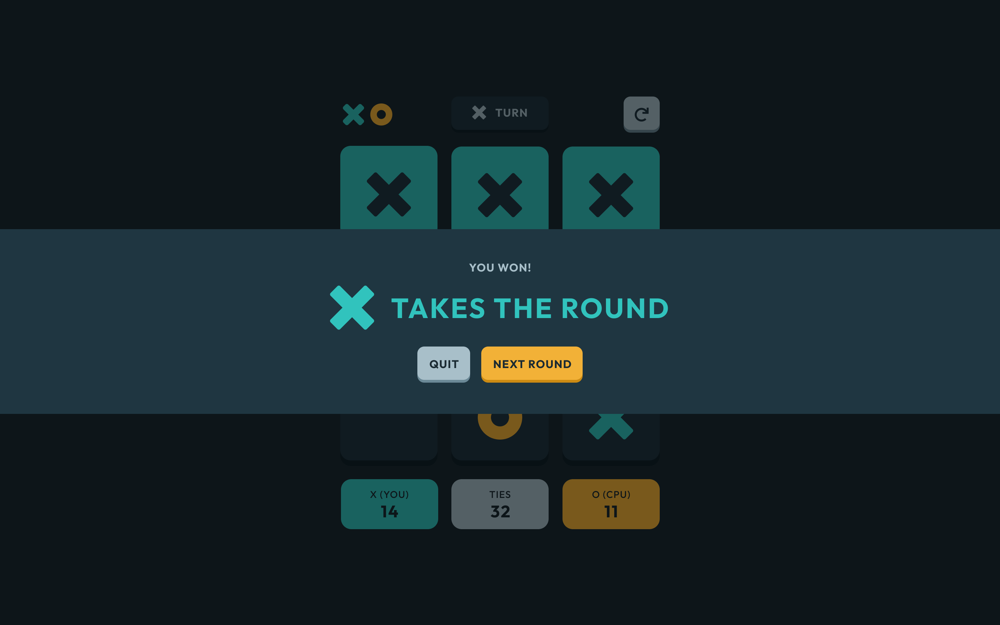
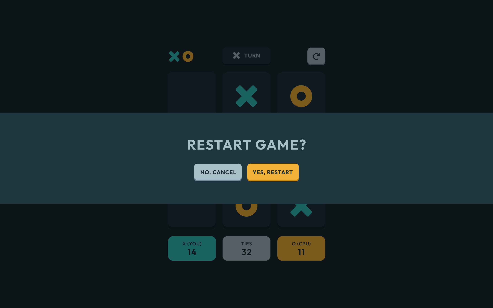

# Tic Tac Toe solution

Tic Tac Toe is a simple game in which two players alternately put Xs and Os in compartments of a figure formed by two vertical lines crossing two horizontal lines and each tries to get a row of three Xs or three Os before the opponent does.

What unique about this project is you have two options whether to play vs CPU or another player which makes the game here is more interesting.

The game is fully responsive and was set with some animations and a little twist representing CPU thinking.

## Features

- **Welcome Screen**

  - This is the welcome screen. Here the user has the option to select X or O mark and to decide whether to play againest the CPU or another player.

- **Gameplay Start**

  - This is the gameboard before any of the users or CPU selects a cell.

- **Solo Gameplay**
  - If the user decided to play againest the CPU then the scoreboard will be updated with proper titles that matches the game situation.
  - The computer will start first if the player selected O mark since X will start first in all cases.
  - The user will start first if he selected the X mark.

- **Multiplayer Gameplay**
  - If the user decided to play againest another player then the scoreboard will be updated with proper titles that matches the game situation.
  - X will start first then O

- **Round Tie**
  - The message that will be displayed if there is a tie
  - There will be two options wether to go for the next round or to quit the game and return back to the welcome screen.

- **Multiplayer Player 1 Win**
  - The message that should be displayed if the user starts with multiplayer version and Player 1 wins.

- **Multiplayer Player 2 Win**
  - The message that should be displayed if the user starts with multiplayer version and Player 2 wins.

- **Solo Gameplay CPU Wins**
  - The message that should be displayed if the user starts with solo gameplay and CPU wins.

- **Solo Gameplay Player Wins**
  - The message that should be displayed if the user starts with solo gameplay and the player wins.

- **Restart Button**
  - When clicking the RESTART button. The user has two options whether to cancel and returns back to the gameplay or to restart the game so all the cards will be rest so the user can start a new game.

## Technologies Used

- Semantic HTML5 markup
- CSS custom properties
- Flexbox
- CSS Grid
- SASS
- Vanilla Javascript
